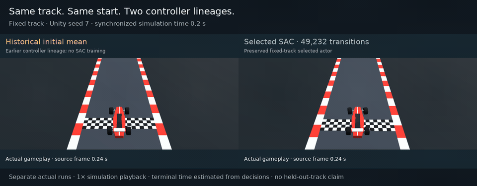

# Recurrent Racer

Learn to steer from eleven raycasts. **Recurrent Racer** combines a Unity racing environment with a custom PyTorch Soft Actor-Critic agent for continuous steering and throttle.

[Run it](#watch-the-selected-policy) · [Environment](docs/environment.md) · [Training](docs/training.md) · [Evidence](docs/evaluation.md)



[Watch the higher-quality MP4](docs/media/comparison.mp4) · [Checkpoint provenance](docs/checkpoint.md) · [Reproduce the run](docs/reproduction.md)

The historical initial mean fails to finish at 8.7 s; the selected SAC actor finishes at an estimated 20.0 s. These are separate actual runs on the same fixed track and start, synchronized by simulated time at 1× playback. The failed panel holds its last captured frame. The initial mean comes from an earlier controller lineage, not an intermediate SAC checkpoint. [Capture metadata](docs/media/comparison-capture.json)

## Preserved fixed-track baseline

The original [selected-policy GIF](docs/media/hero.gif) and [MP4](docs/media/hero.mp4), numerical records and checkpoint remain preserved. The comparison above uses the updated presentation; its selected rollout matches the historical numerical trace exactly. [Rendered comparison](results/procedural/rendered-fixed-comparison.json)

| Selected policy | Recorded result |
| :--- | :--- |
| Original-start finishes | **3 / 3**, using the terminal-reward finish proxy |
| Estimated finished-lap time | **20.0 s** in each repeated episode |
| SAC training at selection | **49,232 transitions**, training seed **7** |

The included inference checkpoint is **25.1 kB** (`policies/selected.pt`). These are deterministic evaluations on **one fixed track**, with Unity seed 7 and a 120-second episode cap. The repeated starts measure repeatability, not robustness. Time is estimated from 0.1-second decision intervals. The checkpoint was selected by finish fraction, then lap time, then return; a later checkpoint's higher return did not make it faster.


A fresh source rebuild reproduced the original selected-policy trace exactly, including observations, actions and rewards. [Integrated numerical comparison](results/procedural/integrated-fixed-comparison.json) · [Current validation ledger](docs/procedural-validation.md)

## How it works

- **Unity/C#:** 50 Hz arcade vehicle physics, ordered gates, signed route-progress reward, and eleven road-edge raycasts.
- **Python/PyTorch:** a 15-input Gaussian actor, continuous steering and signed throttle, uniform replay, twin critics, and learned entropy temperature.
- **Engineering:** reward/action alignment across episode boundaries, time-limit bootstrapping, atomic checkpoints, replay/RNG restoration, and evaluation isolated from training.


## What the policy sees


Cyan segments end at real road-edge hits; amber segments represent no hit within 40 metres. The opt-in overlay displays the **same samples collected for the policy**, at the physics pose of the decision. It adds no observations. Rendered images are for people: the actor receives eleven normalized distances plus forward speed, lateral speed, yaw rate and applied steering. It receives no image, map, waypoints or position.

[Perception MP4](docs/media/perception.mp4) · [Observation/action diagram and interface](docs/environment.md) · [Capture procedure](docs/capture.md)

## Learning to drive

The car has two continuous controls and Unity experience has a collection cost. SAC reuses that experience through replay and trains a stochastic bounded policy against learned action values. This implementation combines two Q networks, slowly moving target critics and automatic entropy-temperature tuning. Evaluation uses `tanh(mean)` for repeatable control. The project name is **Recurrent Racer**, but this selected actor is **feedforward**, with no recurrent memory.

[Implemented SAC pipeline and diagram](docs/training.md)

## Watch the selected policy

Use **Python 3.10.12** and **Unity 6000.6.3f1**. The tested platform is macOS arm64, with CPU PyTorch. Install dependencies and build the source environment as described in [setup](docs/reproduction.md); macOS arm64 needs the documented gRPC source-build step.

From the repository root, after setup:

```sh
.venv/bin/python python/train_sac.py view \
  --checkpoint policies/selected.pt --eval-episodes 1
```

For headless evaluation of the original start and fixed approach starts:

```sh
.venv/bin/python python/train_sac.py evaluate \
  --checkpoint policies/selected.pt --approaches --eval-episodes 3
```

`--env` selects another compatible Unity player; the default is the repository's `RacingEnvironment/Builds/macOS/RacingCurriculum.app`. Generated players are excluded from Git.

## Seeded open tracks

Procedural mode builds reproducible roads from varied straights and left/right arcs. A shared centerline defines road surfaces, sensor edges, collision boundaries, spawn, ordered checkpoints and finish. The existing fixed track remains the default. Seeded training starts mix **75% near-turn approaches** (10–20 m before different left/right turn entries) with **25% original starts**. A separate spawn seed reproduces the selected turn and pose; progress and gate credit begin at that actual start.

```sh
.venv/bin/python python/train_sac.py evaluate \
  --checkpoint policies/selected.pt --track-mode procedural \
  --track-eval-seeds 1009 2003 3001 --track-eval-spawn-indices -1 \
  --eval-episodes 1 \
  --output runs/my-procedural-evaluation
```

In the **original-start, pre-curriculum** procedural transfer probe, the fixed-track selected actor finished **0 / 3** held-out routes, with **38.53%** mean normalized route progress; the historical initial mean finished **0 / 3**, with **12.27%** progress. Each used the same three route seeds, default generation parameters and spawn at 4 m. These route seeds are held out from training but reused for policy selection; they are validation routes, not an untouched final test. These are small transfer probes, not a generalization benchmark. [Recorded results](results/procedural/selected-heldout-result.json) · [Initial mean](results/procedural/initial-mean-heldout-result.json)

The command above evaluates original starts only. Omit `--track-eval-spawn-indices -1` to evaluate each route at its original start and 15 m before each of its five turns: **18 matched tasks**. Before new training, the transferred selected mean finished **6 / 18** tasks, all shorter route suffixes, while still finishing **0 / 3** original routes. Partial-route finishes do not establish full-route completion. [Task-level baseline](results/procedural/curriculum-selected-baseline.json)

The bounded pilot completed **20,000 new procedural training transitions** in **168.01 session wall seconds**. Its selected actor is from **12,210 new transitions**, initialized from the fixed actor's trunk/mean after its historical 49,232 SAC transitions, with fresh critics, replay and optimizers.

| Actor on the same 18 validation tasks | All tasks | Original routes |
| :--- | :--- | :--- |
| Transferred fixed mean, before new training | 6 / 18 | 0 / 3 |
| Selected procedural actor | **18 / 18** | **3 / 3** |

The inference export reproduced all 18 selected-checkpoint traces exactly in a fresh run. It ranked ahead of the final 20,000-transition actor by mean estimated time across the **same mixed full-route/suffix task set** (10.761 s vs 11.128 s); this is not a lap-time comparison. [Policy provenance](policies/procedural-provenance.json) · [Pilot evidence](results/procedural/pilot-summary.json) · [Fresh verification](results/procedural/selected-fresh-verification.json)

Watch the new actor on procedural seed 1009 from the original start:

```sh
.venv/bin/python python/train_sac.py view \
  --checkpoint policies/procedural-selected.pt --track-mode procedural \
  --track-eval-seeds 1009 --track-eval-spawn-indices -1 --eval-episodes 1
```

Generation checks cover 1,000 seeds. Repeated held-out rollouts matched exactly after copying the selected actor mean into fresh SAC state. These checks establish geometry and run reproducibility; learned-policy evidence comes from the matched task evaluations above. [Generation and configuration](docs/procedural-tracks.md) · [Validation and experiment protocol](docs/procedural-validation.md)

## Train

```sh
.venv/bin/python python/train_sac.py train \
  --config configs/train.json --output runs/my-sac
```

The configuration requests one million training transitions. The historical run stopped at 119,798; its selected policy is from 49,232. Training defaults to the included mean-controller initialization with fresh SAC critics, replay and optimizers. Use `--from-scratch` for a new initialization, or resume a local `latest.pt` into a new output directory. Those are different experiments; the selected result is not promised for either.

For the bounded procedural curriculum, export only the preserved selected actor's mean and initialize fresh SAC critics, replay and optimizers:

```sh
.venv/bin/python tools/export_mean_initialization.py \
  policies/selected.pt runs/my-selected-mean.pt
.venv/bin/python tools/run_bounded_training.py --wall-seconds 900 \
  --log runs/my-curriculum-launch.log --report runs/my-curriculum-wall.json -- \
  .venv/bin/python python/train_sac.py train \
  --config configs/procedural/curriculum-pilot.json \
  --warm-start runs/my-selected-mean.pt --output runs/my-curriculum
```

The [curriculum configuration](configs/procedural/curriculum-pilot.json) requests **20,000 transitions and a 900-second session cap**. The wrapper enforces the wall ceiling across training and evaluation, then allows up to 30 seconds for orderly checkpoint/Unity cleanup. The run selects policies on the same 18 validation tasks. A revised 128-transition smoke and resume to 192 verified collection, updates, checkpoint restoration and completed training episodes; the smoke's final evaluation finished 0/18, so it supports no learning-improvement claim. [Smoke evidence](results/procedural/curriculum-training-smoke.json)

[Training details](docs/training.md) · [Evaluation evidence](docs/evaluation.md) · [Validation](docs/validation.md) · [Rights and attribution](THIRD_PARTY_NOTICES.md)

## Scope and limitations

The historical selected-policy evidence covers one fixed track. Its recorded performance does not establish transfer to new geometry. The procedural transfer probes use three held-out route seeds and one policy per lineage; independent training seeds, broad perturbations, a fastest-lap claim and algorithm benchmark comparisons remain untested. Finish is inferred from the terminal reward under the verified reward contract; decision-count timing can overestimate the final interval by about 0.08 seconds. The source project was rebuilt and exercised locally with the existing Python environment; a fresh dependency install on a clean machine has not been tested.

This publication copy contains the final SAC learner, environment, compact evidence and actual gameplay. Earlier learning algorithms, bulk logs, replay state, caches, virtual environments and generated builds remain outside the public content. Original experiments are preserved locally. [Publication checklist](PUBLICATION_CHECKLIST.md)
