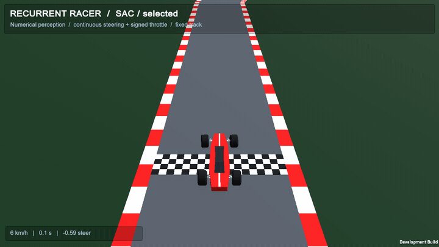
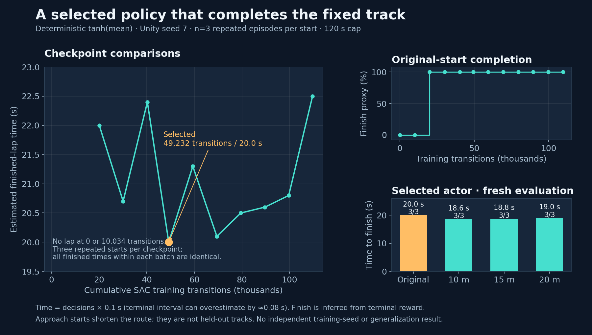
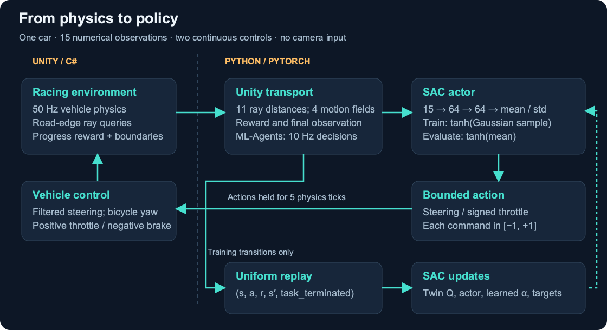
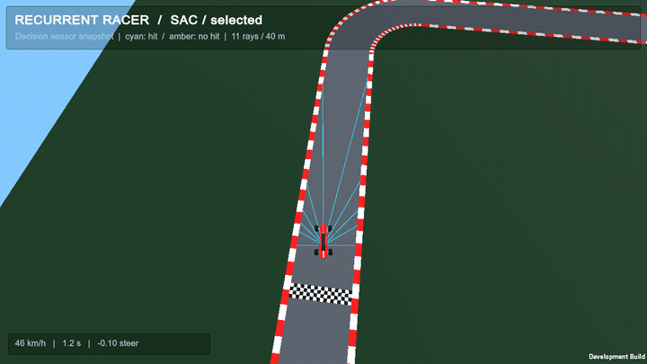

# Recurrent Racer

A Unity racing environment with numerical raycast perception and a custom PyTorch Soft Actor-Critic agent for continuous vehicle control.



[Watch the higher-quality MP4](docs/media/hero.mp4) · [Checkpoint provenance](docs/checkpoint.md) · [Reproduce the run](docs/reproduction.md)

| Selected policy | Verified result |
| :--- | :--- |
| Original-start finishes | **3 / 3**, using the terminal-reward finish proxy |
| Estimated finished-lap time | **20.0 s** in each repeated episode |
| Mean raw episode return | **5.8846** |
| SAC training at selection | **49,232 transitions**, training seed **7** |
| Inference checkpoint | **25.1 kB**, included in `policies/selected.pt` |

These are deterministic evaluations on **one fixed track**, with Unity seed 7 and a 120-second episode cap. The repeated starts measure repeatability, not robustness. Time is estimated from 0.1-second decision intervals. The checkpoint was selected by finish fraction, then lap time, then return; a later checkpoint's higher return did not make it faster.



## From simulation to control

- **Unity/C#:** 50 Hz arcade vehicle physics, ordered gates, signed route-progress reward, and eleven road-edge raycasts.
- **Python/PyTorch:** a 15-input Gaussian actor, continuous steering and signed throttle, uniform replay, twin critics, and learned entropy temperature.
- **Engineering:** reward/action alignment across episode boundaries, time-limit bootstrapping, atomic checkpoints, replay/RNG restoration, and evaluation isolated from training.



## What the policy sees



Cyan segments end at real road-edge hits; amber segments represent no hit within 40 metres. The opt-in overlay displays the **same samples collected for the policy**, at the physics pose of the decision. It adds no observations. Rendered images are for people: the actor receives eleven normalized distances plus forward speed, lateral speed, yaw rate and applied steering. It receives no image, map, waypoints or position.

[Perception MP4](docs/media/perception.mp4) · [Observation/action diagram and interface](docs/environment.md) · [Capture procedure](docs/capture.md)

## Why SAC fits this task

The car has two continuous controls and Unity experience has a collection cost. SAC reuses that experience through replay and trains a stochastic bounded policy against learned action values. This implementation combines two Q networks, slowly moving target critics and automatic entropy-temperature tuning. Evaluation uses `tanh(mean)` for repeatable control. The project name is **Recurrent Racer**, but this selected actor is **feedforward**, with no recurrent memory.

[Implemented SAC pipeline and diagram](docs/training.md)

## Watch the selected policy

Use **Python 3.10.12** and **Unity 6000.6.3f1**. The tested platform is macOS arm64, with CPU PyTorch. Install dependencies and build the source environment as described in [setup](docs/reproduction.md); macOS arm64 needs the documented gRPC source-build step.

From the repository root, after setup:

```sh
.venv/bin/python python/train_sac.py view \
  --checkpoint policies/selected.pt --eval-episodes 1
```

For headless evaluation of the original start and fixed approach starts:

```sh
.venv/bin/python python/train_sac.py evaluate \
  --checkpoint policies/selected.pt --approaches --eval-episodes 3
```

`--env` selects another compatible Unity player; the default is the repository's `RacingEnvironment/Builds/macOS/RacingCurriculum.app`. Generated players are excluded from Git.

## Train

```sh
.venv/bin/python python/train_sac.py train \
  --config configs/train.json --output runs/my-sac
```

The configuration requests one million training transitions. The historical run stopped at 119,798; its selected policy is from 49,232. Training defaults to the included mean-controller initialization with fresh SAC critics, replay and optimizers. Use `--from-scratch` for a new initialization, or resume a local `latest.pt` into a new output directory. Those are different experiments; the selected result is not promised for either.

[Training details](docs/training.md) · [Evaluation evidence](docs/evaluation.md) · [Validation](docs/validation.md) · [Rights and attribution](THIRD_PARTY_NOTICES.md)

## Scope and limitations

No held-out tracks, independent training seeds, broad perturbations, fastest-lap claim or algorithm benchmark comparison are supported. Finish is inferred from the terminal reward under the verified reward contract; decision-count timing can overestimate the final interval by about 0.08 seconds. The source project was rebuilt and exercised locally with the existing Python environment; a fresh dependency install on a clean machine has not been tested.

This publication copy contains the final SAC learner, environment, compact evidence and actual gameplay. Earlier learning algorithms, bulk logs, replay state, caches, virtual environments and generated builds remain outside the public content. Original experiments are preserved locally. [Publication checklist](PUBLICATION_CHECKLIST.md)
