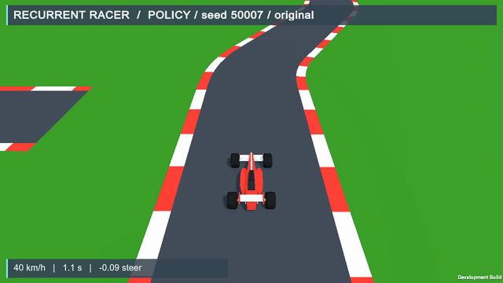
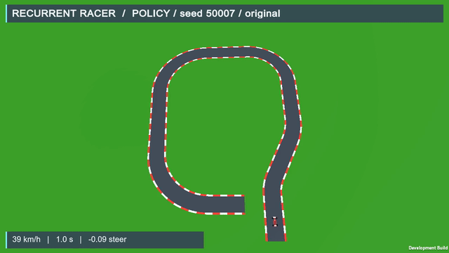
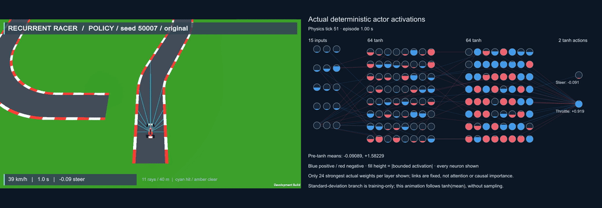
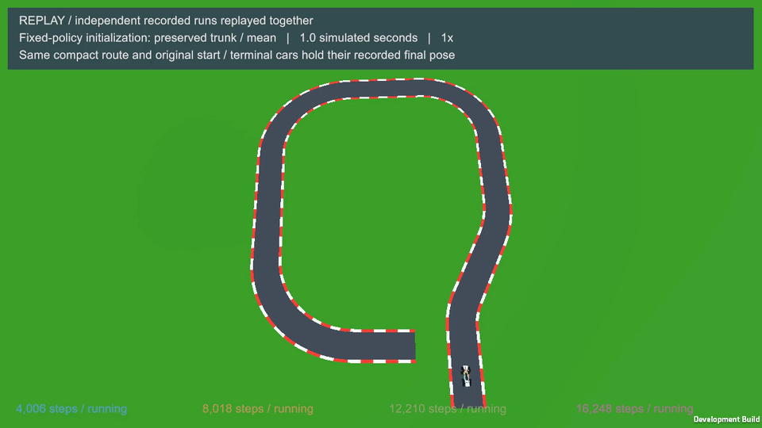

# Recurrent Racer

Learn to steer from eleven raycasts. A Unity formula-style racer uses a custom PyTorch Soft Actor-Critic agent to drive compact open circuits with continuous steering and throttle.

[Watch it](#watch-the-selected-policy) · [Environment](docs/environment.md) · [Training](docs/training.md) · [Quality evidence](docs/compact-validation.md) · [Earlier open-route showcase](docs/open-quality-history.md) · [Historical experiments](docs/history.md)





[Full recorded chase MP4](docs/media/compact/50007-chase.mp4) · [Full recorded overview MP4](docs/media/compact/50007-overview.mp4) · [All five demonstrations and capture metadata](docs/compact-showcase.md)

The two views show the same frozen actor on seed 50007 from the original start. GIFs are contiguous excerpts; recorded videos preserve the contiguous recorded first episode. Timing metadata identifies any terminal holds and excluded reset frames. Visual acquisition begins shortly after launch (the exact recorded interval in each manifest); metadata records each exact acquisition gap. The development-build watermark is retained.

## Measured full-route driving

The preserved actor finished **40 / 40 untouched test routes cleanly**. Five demonstration routes chosen from geometry before driving also finished cleanly in chase and overview, with exact headless/chase/overview numerical parity. The inference export reproduced the actor's actions bit for bit.


| Evaluation | Result |
| :--- | :--- |
| Development original routes, seeds 50000–50007 | **8 / 8 clean finishes** |
| Untouched original routes, seeds 60000–60039 | **40 / 40 clean finishes** |
| Untouched mean actual simulated finish time | **16.69 s** |
| Geometry-preselected demonstrations | **5 / 5 clean**, both cameras |
| Additional training in this compact phase | **0 transitions** |

Clean means no reverse span over 0.5 s, no qualifying stall over 2 s after a 2 s launch grace, and at most 5% of driving time outside asphalt. Quality telemetry is passive and sampled at physics ticks. The actor was frozen before the single untouched compact test; test routes did not select a checkpoint or trigger retraining. [Untouched report](results/compact/held-out.json) · [Capture gate](results/compact/capture-gate.json) · [Approved protocol](docs/compact-plan.md)

This is evidence for one actor on sampled roads from the compact generator. It does not establish robustness outside the generator, performance under broad perturbations, fastest driving, or an algorithm benchmark.

## Watch the actor compute



[Full recorded activation MP4](docs/media/compact/activations-50007.mp4) · [Exact timing and capture evidence](docs/media/compact/activations-50007.media.json) · [Synchronization mapping](docs/media/compact/activations-50007.composition.json)

Actual ray gameplay is paired with all 15 inputs, both 64-neuron tanh layers and both bounded actions. Blue means positive, red negative; circle fill height is absolute bounded activation. Pre-tanh means are numeric. Only the 24 globally strongest absolute weights per layer are drawn, with fixed deterministic ties; other connections are omitted. Links do not represent attention or causal importance. The standard-deviation branch is used during training; this animation follows deterministic `tanh(mean)`.

All 139 recorded actions and pre-tanh means reproduced bit for bit. Each decision's eleven ray inputs matched the actual same-tick samples. A gameplay frame displays the latest recorded decision at or before its physics tick. This full recorded MP4 spans 0.30–13.82 simulated seconds; the measured finish was 13.86 s, so the initial acquisition gap is 0.30 s and the final visual gap is 0.04 s. The GIF shows 1–9 s.

## What the policy sees

The actor receives **15 numbers**: eleven normalized road-edge ray distances, forward speed, lateral speed, yaw rate and applied steering. Rendered images are for people. It receives no image, map, waypoint list or position. The selected actor is feedforward; the project name does not imply recurrent memory.

Unity runs 50 Hz arcade physics, ordered gates and signed route-progress reward. PyTorch SAC uses a Gaussian actor, twin critics, uniform replay and learned entropy temperature. Evaluation applies `tanh(mean)` for repeatable control. The visual pass keeps actor inputs, rewards, dynamics, sensor geometry and colliders unchanged.


Compact routes keep a separate start and finish; they are open circuits. Red/white alternating curbs are visual, preserving collision and sensor geometry. Explicit `--track-layout open` reproduces the earlier open routes.

[Observation and action interface](docs/environment.md) · [Implemented SAC pipeline](docs/training.md) · [Seeded geometry](docs/procedural-tracks.md)

## Watch the selected policy

Use Python 3.10.12 and Unity 6000.6.3f1. The tested platform is macOS arm64 with CPU PyTorch. Follow [setup and build instructions](docs/reproduction.md), including the documented gRPC source-build step.

After setup, the bare viewer selects the accepted compact actor and seed 1009 from the original start:

```sh
.venv/bin/python python/train_sac.py view
```

Choose a camera explicitly:

```sh
.venv/bin/python python/train_sac.py view --camera overview
```

For an explicit reproducible original-route evaluation:

```sh
.venv/bin/python python/train_sac.py evaluate \
  --checkpoint policies/procedural-selected.pt --track-mode procedural --track-layout compact \
  --track-eval-seeds 50000 50001 50002 --track-eval-spawn-indices -1 \
  --eval-episodes 1 --output runs/my-procedural-evaluation
```

`--env` selects another compatible Unity player. The default player path is `RacingEnvironment/Builds/macOS/RacingCurriculum.app`; generated players are excluded from Git. The native player alone has no embedded actor and idles in agent mode. Use `--racing-manual` for keyboard driving on compact procedural seed 1009, or `--racing-manual --racing-fixed` for historical fixed keyboard driving. Python runs the accepted autonomous actor.

## Saved checkpoints on the same circuit



[Full recorded ghost MP4](docs/media/compact/learning-ghosts-50007.mp4) · [Actual outcomes](results/compact/historical-comparison.json) · [Replay timing](docs/media/compact/learning-ghosts-50007.media.json)

Four authentic checkpoints from the same procedural pilot independently drive geometry-preselected seed 50007 from the same original start. Their exact recorded poses are replayed together as collider-free ghosts, without rays or interactions. Cars stop at their actual terminal poses; a final two-second hold lets viewers inspect the outcomes. The GIF is a contiguous 1–9 s excerpt.

| Pilot checkpoint | Actual result | Simulated terminal time |
| :--- | :--- | :--- |
| 4,006 transitions | Crash | 6.54 s |
| 8,018 transitions | Crash | 5.56 s |
| 12,210 transitions | Finish | 13.86 s |
| 16,248 transitions | Finish | 15.18 s |

These policies share the preserved fixed-policy trunk/mean initialization with fresh procedural SAC state. More training did not make the last checkpoint faster on this route. This comparison is one recorded route, not an algorithm benchmark.

## How learning works


Training samples stochastic actions and reuses aligned transitions through uniform replay. Twin critics learn soft targets, the actor improves its actions, entropy temperature adapts and target critics move slowly. True terminations stop bootstrap; time-limit interruptions retain the actual final observation. Deterministic evaluation is held apart from learning and the untouched test never selects a checkpoint.

## Training and provenance

The selected procedural actor comes from **12,210 new procedural transitions** in a bounded 20,000-transition pilot. It reused the historical fixed actor's trunk and mean after 49,232 SAC transitions, with fresh critics, replay and optimizers. This compact phase added no training because the development baseline was already clean on all eight routes.

The pilot mixed 75% starts near turns with 25% original starts. Its historical selection used mixed full-route and suffix tasks; the new quality evaluation uses original full routes only. [Policy provenance](policies/procedural-provenance.json) · [Pilot evidence](results/procedural/pilot-summary.json) · [Preserved fixed-track comparison, perception media and training commands](docs/history.md)

[Training details](docs/training.md) · [Evaluation evidence](docs/evaluation.md) · [Validation](docs/compact-validation.md) · [Rights and attribution](THIRD_PARTY_NOTICES.md)

A fresh dependency install on a clean machine remains untested. Original policies, results and media are preserved. Bulk logs, replay state, caches, virtual environments and generated builds remain outside publication. [Publication checklist](PUBLICATION_CHECKLIST.md)
