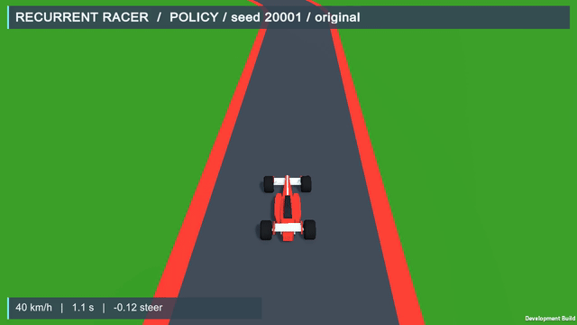
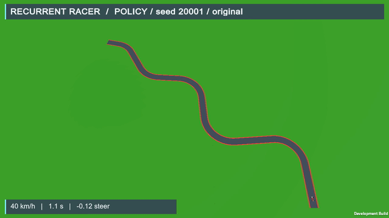

# Recurrent Racer

Learn to steer from eleven raycasts. A Unity formula-style racer uses a custom PyTorch Soft Actor-Critic agent to drive seeded roads with continuous steering and throttle.

[Watch it](#watch-the-selected-policy) · [Environment](docs/environment.md) · [Training](docs/training.md) · [Quality evidence](docs/quality/validation.md) · [Historical experiments](docs/history.md)





[Full chase MP4](docs/media/quality/20001-chase.mp4) · [Full overview MP4](docs/media/quality/20001-overview.mp4) · [All five demonstrations and capture metadata](docs/quality/showcase.md)

The two views show the same frozen actor on seed 20001 from the original start. GIFs are contiguous excerpts; full videos preserve the contiguous recorded first episode. Timing metadata identifies any terminal holds and excluded reset frames. Visual acquisition begins shortly after launch (0.32 simulated seconds in the chase hero); metadata records each exact acquisition gap. The development-build watermark is retained.

## Measured full-route driving

The preserved procedural actor finished **40 / 40 untouched test routes cleanly**. Five demonstration routes chosen from geometry before driving also finished cleanly in chase and overview, with exact headless/chase/overview numerical parity. The inference export reproduced the actor's actions bit for bit.


| Evaluation | Result |
| :--- | :--- |
| Development original routes, seeds 20000–20007 | **8 / 8 clean finishes** |
| Untouched original routes, seeds 30000–30039 | **40 / 40 clean finishes** |
| Untouched mean actual simulated finish time | **16.03 s** |
| Geometry-preselected demonstrations | **5 / 5 clean**, both cameras |
| Additional training in this quality phase | **0 transitions** |

Clean means no reverse span over 0.5 s, no unfinished stall over 2 s after a 2 s launch grace, and at most 5% of driving time outside asphalt. Quality telemetry is passive and sampled at physics ticks. The actor was frozen before the single untouched test; test routes did not select a checkpoint or trigger retraining. [Untouched report](results/quality/held-out.json) · [Capture gate](results/quality/capture-gate.json) · [Final-build parity](results/quality/publication-parity.json) · [Approved protocol](docs/quality/plan.md)

This is evidence for one actor on sampled roads from this generator. It does not establish robustness outside the generator, performance under broad perturbations, fastest driving, or an algorithm benchmark.

## What the policy sees

The actor receives **15 numbers**: eleven normalized road-edge ray distances, forward speed, lateral speed, yaw rate and applied steering. Rendered images are for people. It receives no image, map, waypoint list or position. The selected actor is feedforward; the project name does not imply recurrent memory.

Unity runs 50 Hz arcade physics, ordered gates and signed route-progress reward. PyTorch SAC uses a Gaussian actor, twin critics, uniform replay and learned entropy temperature. Evaluation applies `tanh(mean)` for repeatable control. The visual pass keeps actor inputs, rewards, dynamics, sensor geometry and colliders unchanged.


[Observation and action interface](docs/environment.md) · [Implemented SAC pipeline](docs/training.md) · [Seeded geometry](docs/procedural-tracks.md)

## Watch the selected policy

Use Python 3.10.12 and Unity 6000.6.3f1. The tested platform is macOS arm64 with CPU PyTorch. Follow [setup and build instructions](docs/reproduction.md), including the documented gRPC source-build step.

After setup, the bare viewer selects the accepted procedural actor and seed 1009 from the original start:

```sh
.venv/bin/python python/train_sac.py view
```

Choose a camera explicitly:

```sh
.venv/bin/python python/train_sac.py view --camera overview
```

For an explicit reproducible original-route evaluation:

```sh
.venv/bin/python python/train_sac.py evaluate \
  --checkpoint policies/procedural-selected.pt --track-mode procedural \
  --track-eval-seeds 30000 30001 30002 --track-eval-spawn-indices -1 \
  --eval-episodes 1 --output runs/my-procedural-evaluation
```

`--env` selects another compatible Unity player. The default player path is `RacingEnvironment/Builds/macOS/RacingCurriculum.app`; generated players are excluded from Git. The native player alone has no embedded actor and idles in agent mode. Use `--racing-manual` for keyboard driving on procedural seed 1009, or `--racing-manual --racing-fixed` for historical fixed keyboard driving. Python runs the accepted autonomous actor.

## Training and provenance

The selected procedural actor comes from **12,210 new procedural transitions** in a bounded 20,000-transition pilot. It reused the historical fixed actor's trunk and mean after 49,232 SAC transitions, with fresh critics, replay and optimizers. This quality phase added no training because the development baseline was already clean on all eight routes.

The pilot mixed 75% starts near turns with 25% original starts. Its historical selection used mixed full-route and suffix tasks; the new quality evaluation uses original full routes only. [Policy provenance](policies/procedural-provenance.json) · [Pilot evidence](results/procedural/pilot-summary.json) · [Preserved fixed-track comparison, perception media and training commands](docs/history.md)

[Training details](docs/training.md) · [Evaluation evidence](docs/evaluation.md) · [Validation](docs/quality/validation.md) · [Rights and attribution](THIRD_PARTY_NOTICES.md)

A fresh dependency install on a clean machine remains untested. Original policies, results and media are preserved. Bulk logs, replay state, caches, virtual environments and generated builds remain outside publication. [Publication checklist](PUBLICATION_CHECKLIST.md)
