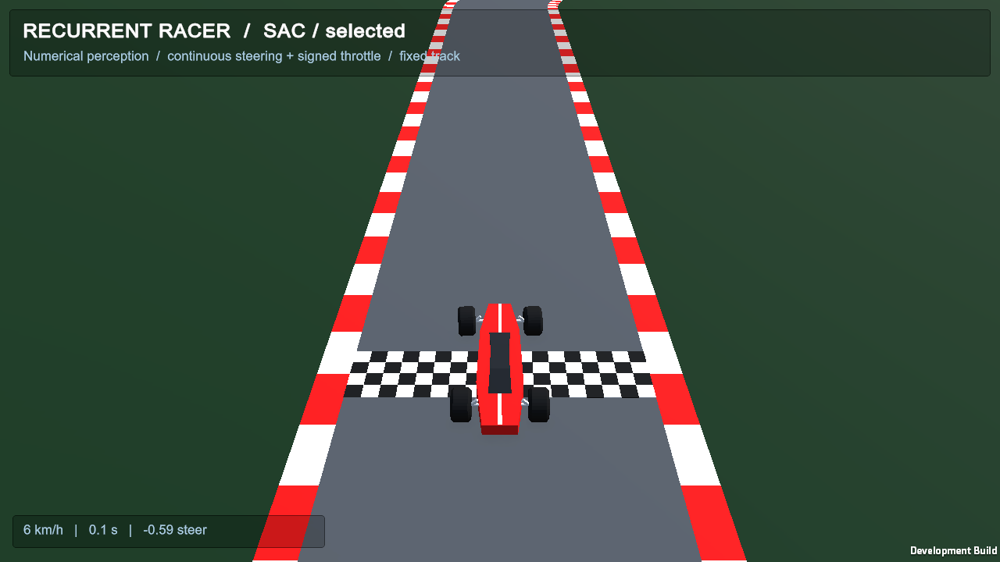

# Real gameplay capture

Both README demonstrations come from `policies/selected.pt` in the **rebuilt curated Unity player**, seed 7, one original-start deterministic episode at time scale 1. Each playback finished under the recorded reward proxy in an estimated 20.0 s. No frames or performance data were synthesized.



## Capture

After setup/build, choose new output directories:

```sh
.venv/bin/python python/train_sac.py view \
  --checkpoint policies/selected.pt --track-mode fixed --eval-episodes 1 \
  --output runs/hero-playback --capture-dir runs/hero-frames
.venv/bin/python python/train_sac.py view \
  --checkpoint policies/selected.pt --track-mode fixed --eval-episodes 1 \
  --output runs/ray-playback --capture-dir runs/ray-frames \
  --sensor-overlay
```

The viewer requests a 1280×720 window. The hero camera looks down 35°, at distance 22 m and FOV 48°. The sensor camera looks down 65°, at distance 48 m, FOV 65° and lookahead 10 m. Camera changes affect human rendering only. The source is a development build, which visibly retains its Unity watermark.

`PortfolioPresentation` writes real PNGs using `ScreenCapture.CaptureScreenshotAsTexture` after rendering, nominally every 0.05 wall seconds, capped at 500 frames. File encoding can lower that rate, so `frames.csv` records actual wall timestamps, physics ticks, episode time and speed. Capture begins after an active throttle command and 0.1 simulated seconds. Raw frames remain in ignored local `runs/`; compact timing and trajectory evidence are retained in [results/capture](../results/capture).

## Ray overlay

The display subscribes to `RoadDistanceSensor.Sampled`. It copies the same physics-pose origin, directions, normalized distances and hit booleans from the queries that fill the observation vector. It does not recompute a decorative sensor fan. All eleven lines update at decision snapshots: cyan means an actual hit, amber means no hit within the full 40 m. Exact-range hits can have distance one and are cyan, even though the actor cannot distinguish them from a no-hit scalar. `ray-samples.csv.gz` retains the query records; all 200 action-observation ray vectors in the captured lap matched these snapshots exactly.

The presentation script is installed only by rendered viewer flags and is excluded explicitly by `--racing-no-render` or batch mode. It changes cameras/GUI and creates collider-free LineRenderers. It never writes vehicle commands, physics settings, clocks, observations or rewards. The snapshot event adds no extra ray queries. Complete recorded observation/action/reward/final-state arrays matched original-player headless evaluation exactly for both rendered laps. See [contract evidence](../results/verification/contract-comparison.json).

## Encoding

Use an independently installed FFmpeg executable; no encoder binary is part of this repository:

```sh
.venv/bin/python tools/encode_media.py runs/hero-frames hero
.venv/bin/python tools/encode_media.py runs/ray-frames perception \
  --start 1 --duration 8
```

The hero is a contiguous approximately 20-second lap capture. The perception loop is an approximately 8-second contiguous excerpt showing the first turn. The encoder preserves source wall-time spacing, outputs H.264 MP4 at 1280×720 / 30 fps, and a 720-pixel-wide looping GIF at 10 fps. It does not speed up driving, join different successful trajectories or remove failures from an evaluation batch. MP4 supports seeking and better image quality.

[Hero metadata](media/hero-capture.json) and [perception metadata](media/perception-capture.json) identify the policy SHA-256, selection step, seed, source interval, camera, frame count, size and media hashes. [Build verification](../results/verification/validation.json) records the curated player identity used for capture.

## Diagrams and charts

SVG sources plus rendered PNGs live in `docs/media/`. `tools/render_diagrams.py` generates the architecture, sensor/interface and actual SAC update diagrams. Optional PNG export needs CairoSVG and its native Cairo library. `tools/plot_performance.py` uses preserved evaluation CSV/JSON data and Matplotlib 3.7.5. These tools are for documentation and are not required to run the policy. No font files are bundled.
