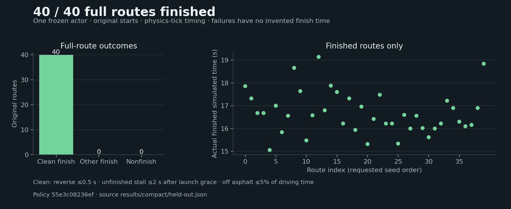
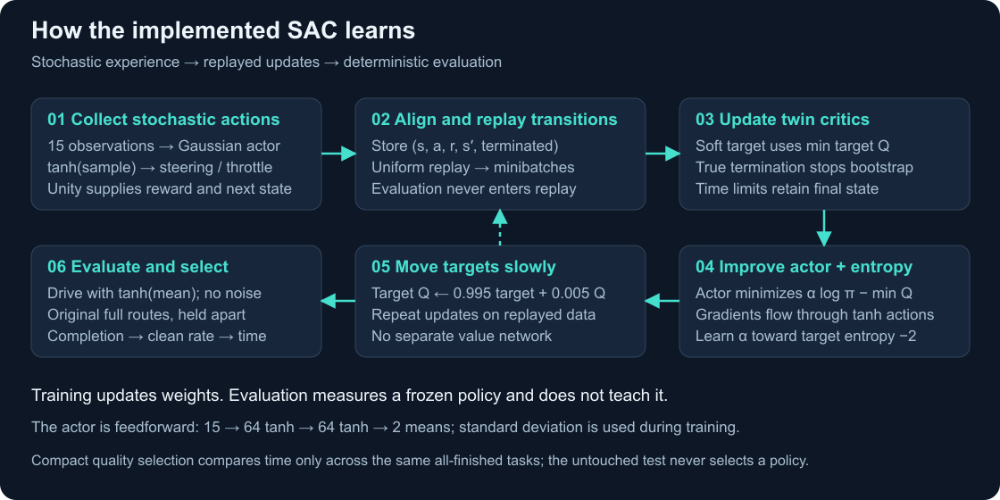

# Compact circuit showcase

The preserved procedural actor finished **8 / 8 compact development routes cleanly** and **40 / 40 untouched compact test routes cleanly**, without additional training. Mean actual simulated test finish time was **16.69 s**. The parent accepted promotion after all five preselected demonstrations finished cleanly in both cameras with exact headless numerical parity.

[Untouched report](../results/compact/held-out.json) · [Approved plan](compact-plan.md) · [Validation](compact-validation.md)

Compact routes are open circuits with separate start and finish. Geometry-only capture seeds are 50007, 50001, 50000, 50002 and 50005. The historical checkpoint comparison uses seed 50007 for all four authentic saved checkpoints, 4,006 / 8,018 / 12,210 / 16,248 transitions from the same pilot. Separate recorded runs are replayed as collider-free ghosts with no sensor rays; failures stop at their actual final poses. More training need not improve a particular route.

The offline actor animation pairs actual ray gameplay with every 15 / 64 / 64 / 2 deterministic-path activation. Fixed sparse connections are the 24 globally strongest absolute weights per layer, explicitly omitting other connections; they are not attention or causal explanations. Blue/red waterfill shows sign and absolute bounded activation. Pre-tanh means are numeric; the standard-deviation branch is training-only. Recorded actions and ray inputs must validate numerically before composition. [Exact capture interface](compact-activation-interface.md)

This is one actor on sampled routes from the compact generator. It establishes neither broad robustness beyond that geometry family nor optimal driving. Earlier open/fixed geometry, policies, metrics and media remain preserved. Untouched-test policy hash: `55e3c08236ef676bd5938743375cca8032b3d0b53228d76dfee146fcb8d65a21`; test-build hash: `9900f4aaf54f5959799bd6604fe9b7561bcf0f16b44bccf4f10a1a5217979005`. Final publication build identity is recorded separately.

## Recorded demonstrations

Every GIF uses the same 1–9 s simulated interval. MP4s contain the full contiguous recorded first episode at 1×, with exact acquisition/last-frame/terminal intervals and cadence gaps in metadata. They do not invent missing launch or terminal images.

| Seed | Chase | Fixed overview |
| :--- | :--- | :--- |
| 50007 | [Recorded MP4](media/compact/50007-chase.mp4) · [GIF](media/compact/50007-chase.gif) · [Timing](media/compact/50007-chase.media.json) | [Recorded MP4](media/compact/50007-overview.mp4) · [GIF](media/compact/50007-overview.gif) · [Timing](media/compact/50007-overview.media.json) |
| 50001 | [Recorded MP4](media/compact/50001-chase.mp4) · [GIF](media/compact/50001-chase.gif) · [Timing](media/compact/50001-chase.media.json) | [Recorded MP4](media/compact/50001-overview.mp4) · [GIF](media/compact/50001-overview.gif) · [Timing](media/compact/50001-overview.media.json) |
| 50000 | [Recorded MP4](media/compact/50000-chase.mp4) · [GIF](media/compact/50000-chase.gif) · [Timing](media/compact/50000-chase.media.json) | [Recorded MP4](media/compact/50000-overview.mp4) · [GIF](media/compact/50000-overview.gif) · [Timing](media/compact/50000-overview.media.json) |
| 50002 | [Recorded MP4](media/compact/50002-chase.mp4) · [GIF](media/compact/50002-chase.gif) · [Timing](media/compact/50002-chase.media.json) | [Recorded MP4](media/compact/50002-overview.mp4) · [GIF](media/compact/50002-overview.gif) · [Timing](media/compact/50002-overview.media.json) |
| 50005 | [Recorded MP4](media/compact/50005-chase.mp4) · [GIF](media/compact/50005-chase.gif) · [Timing](media/compact/50005-chase.media.json) | [Recorded MP4](media/compact/50005-overview.mp4) · [GIF](media/compact/50005-overview.gif) · [Timing](media/compact/50005-overview.media.json) |

[Capture manifests](../results/compact/capture-manifests.json) · [Accepted camera gate](../results/compact/capture-gate.json)

## Actor computation

[Recorded MP4](media/compact/activations-50007.mp4) · [GIF](media/compact/activations-50007.gif) · [Timing](media/compact/activations-50007.media.json) · [Exact decision mapping](media/compact/activations-50007.composition.json)

All 139 actual recorded actions and pre-tanh means match bit for bit; all eleven rays match same-tick actor inputs. Recorded visual interval 0.30–13.82 s, actual finish 13.86 s; initial 0.30 s and final 0.04 s visual gaps are retained as gaps.

## Authentic pilot checkpoint replay

[Full recorded ghost MP4](media/compact/learning-ghosts-50007.mp4) · [1–9 s GIF](media/compact/learning-ghosts-50007.gif) · [Timing](media/compact/learning-ghosts-50007.media.json) · [Actual outcomes](../results/compact/historical-comparison.json)

Independent original-start runs on seed 50007: 4,006 transitions crashed at 6.54 s; 8,018 crashed at 5.56 s; 12,210 finished at 13.86 s; 16,248 finished at 15.18 s. The ghosts reproduce recorded poses without interactions or sensor rays. Failures and finishes hold their actual final poses; the final two-second endpoint hold is retained, while frozen post-endpoint capture frames are excluded and counted. More training did not improve time on this route.
