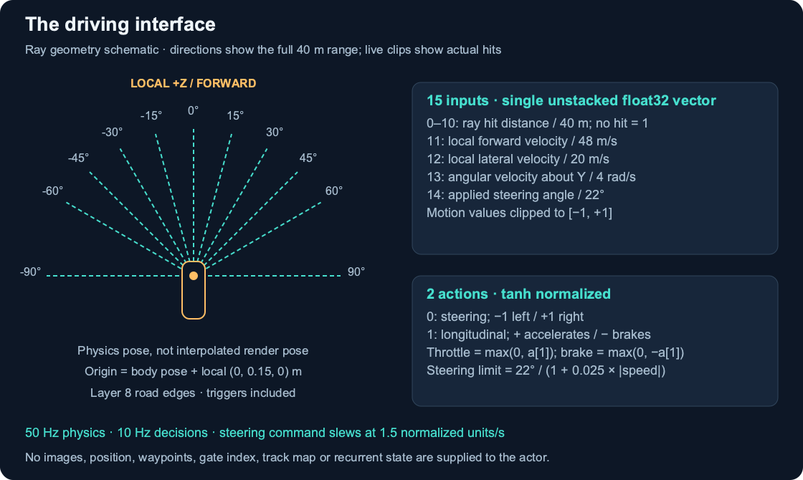

# Environment and control interface

The completed environment is `RacingEnvironment/Assets/Racing/Scenes/RacingTraining.unity`. The source scene contains a rounded-square track, one arcade rigidbody car, invisible road-edge sensor colliders and four ordered gates. `ManualRacer.unity` and the procedural builders preserve environment/asset construction; they are not alternative learning implementations.

## Numerical observations

`RacingAgent.FillObservations` supplies one unstacked float32 vector of length 15. `RoadDistanceSensor` uses the **Rigidbody physics pose**, rather than the interpolated visual transform.

| Index | Field | Units / encoding |
| --- | --- | --- |
| 0–10 | Ray distance, angles −90, −60, −45, −30, −15, 0, 15, 30, 45, 60, 90 degrees | Hit distance / 40 m; no hit = 1 |
| 11 | Local forward velocity | m/s divided by 48 |
| 12 | Local lateral velocity | m/s divided by 20 |
| 13 | Y-axis angular velocity | rad/s divided by 4 |
| 14 | Applied steering angle | degrees divided by 22 |

Motion fields are clipped to [−1, 1]. Ray origin is body position + body rotation × local `(0, 0.15, 0)` metres. Positive ray angles rotate local forward toward local right. Queries use layer 8 (`RacingRoadEdge`), include trigger colliders, and exclude the car. Layer 8/9 collision is ignored. The road is 9 m wide with 1 m curbs; sensors measure the grey-road edges, not the outer crash boundary. A normalized distance of one alone cannot distinguish a no-hit from an exact maximum-range hit; only the optional human overlay retains the raw hit boolean.

## Actions and timing

ML-Agents behavior is `RecurrentRacer`, one 15-float observation, two continuous actions, no discrete branches, no ONNX model, no stacked frames and no child sensors. Physics runs every 0.02 s; a decision every five physics ticks gives a nominal 10 Hz policy rate.

Action 0 is steering: −1 turns left and +1 turns right. Action 1 is signed longitudinal control: throttle = `max(0, a[1])`; brake = `max(0, -a[1])`. Each action is clipped to [−1, 1], and nonfinite inputs become zero. Controls are held between decisions.

`ArcadeVehicle` slews the steering command at 1.5 normalized units/s. Applied angle is filtered command × `22 / (1 + 0.025 × abs(forward_speed_mps))` degrees. The bicycle yaw approximation uses wheelbase 3.4 m. Acceleration is 12 m/s², braking 18 m/s², speed cap 48 m/s, drag coefficient 0.15/s and lateral damping 3.5/s. These are an arcade model, not a validated real car model.

## Reward and endings

At each physics step, reward is `0.01 × signed credited progress in metres - 0.005 × elapsed simulated seconds`. A valid ordered finish adds +1. Failures carry no extra penalty, but end future reward collection. Progress is bounded by the next valid gate to resist shortcuts and implausible jumps. Route projection, gate index and position are reward-only data, never actor observations.

Crash, off-track, invalid progress, finish and no progress are task terminations. No-progress detection requires 0.5 m advance within 15 s. The 120 s timeout is an interruption, and SAC bootstraps from the actual final observation. Each reset clears motion, applied steering, held actions, route state and visual history.

Training uses 75% starts sampled 10–20 m before the first corner, and 25% original starts. This changes only the initial car pose. Evaluations explicitly disable the random curriculum; approach probes use fixed 10/15/20 m starts with the same track and ordered finish.

## Presentation isolation

`PortfolioPresentation` exists only in this publication copy. A rendered viewer opts in with player flags. Headless training creates no presentation component or snapshot subscriber. The sensor executes the same ray queries and normalization; a subscriber receives a copy of their origin, directions, distances and hit booleans. The renderer displays those decision snapshots. Camera and GUI changes are for humans. Full recorded numerical traces matched the original player exactly in the bounded verification; see [validation](validation.md).

Sources: `Assets/Racing/Scripts/RL/RacingAgent.cs`, `RoadDistanceSensor.cs`, `RouteProgress.cs`, and `Vehicle/ArcadeVehicle.cs` under the Unity project.
