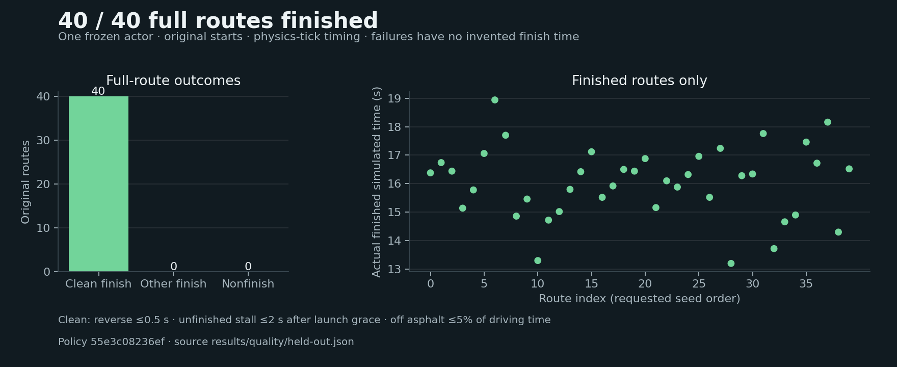

# Procedural showcase and capture evidence

The parent accepted the frozen-policy quality gate: 40 / 40 untouched routes clean, all five geometry-preselected demonstrations clean in both cameras, and exact numerical parity. All ten publication videos use the final presentation build and also pass clean-finish and exact numerical/action parity checks.

A formula-style racer learns continuous steering and throttle from eleven road-edge raycasts. Unity generates seeded roads with varied straights, left/right turns and reproducible starting poses; PyTorch SAC reuses experience through replay. The actor receives fifteen numbers, not rendered images.

## Measured full-route results

The existing selected procedural actor finished **40 / 40 untouched test routes cleanly** (seeds 30000–30039, original starts). Mean actual simulated finish time was 16.03 seconds. The development baseline was already 8 / 8 clean, so this phase added no training and preserved the selected checkpoint at transition 12,210.

[Untouched report](../../results/quality/held-out.json) · [Development report](../../results/quality/development-baseline.json)

These are measured results for one frozen actor and the sampled routes. All five preselected full-route captures passed cleanliness and exact headless/chase/overview parity. [Accepted capture gate](../../results/quality/capture-gate.json) records the audit.

## Demonstrations

Chase and fixed whole-route cameras show the same frozen actor on five development routes chosen from geometry **before driving outcomes**: 20001, 20003, 20007, 20002 and 20005. Every recorded full run is linked as MP4 below. Small GIFs are clearly labeled contiguous excerpts; their seeds, source intervals, camera, checkpoint and build identities are recorded. All preselected routes passed; the protocol prohibited substituting failed routes.

## Quality gate

Training routes are 10000–10031; development routes 20000–20007 select the actor using full-route completion, clean finish rate, then actual simulated time across identical all-finished tasks. Clean means no reverse span over 0.5 s, no unfinished stall span over 2 s after 2 s launch grace, and at most 5% driving time outside asphalt.

After the actor/hash is frozen, exactly one untouched test uses 40 original routes 30000–30039. Promotion requires at least 38 finishes, all five preselected full demonstrations clean, and exact headless/chase/overview numerical parity. One training RNG seed, finite sampled geometry and this threshold do not establish universal robustness or optimal driving.

## Reproducibility

Record training initialization, budgets, configuration, independent route/spawn seeds, geometry/task identities, checkpoint provenance and timing definitions. Suffix curriculum probes remain separate from full-route selection. Actual physics-tick time is used for quality figures; decision-count estimates retain their own labels.

[Approved plan](plan.md) · [Telemetry interface](interfaces.md) · [Validation ledger](validation.md) · [Earlier checkpoint evidence](../../policies/procedural-provenance.json)

## Accepted promotion

The accepted gate promoted the procedural showcase to the primary README. [Historical documentation](../history.md) preserves earlier fixed-track and pilot comparisons, while all old policies, results and media remain untouched.

## Build provenance

The untouched test and original accepted capture gate used frozen build `0d191acfbf7d435279cf5baa796ed3ff40abb70965e9a0b1f6f2401100c85d72`. Publication videos use final build `559b3cc5f34710ce67ab7a393a69e54b9ed230c71026e7099adec1fb49126fbe`, which includes the final grass extent and accepted launch defaults. Its development traces match exactly and all ten publication captures are clean with exact headless/camera/action parity. The actor hash remains `55e3c08236ef676bd5938743375cca8032b3d0b53228d76dfee146fcb8d65a21`; no test result was used to retrain or reselect it.

[Publication parity](../../results/quality/publication-parity.json) · [Capture manifests](../../results/quality/capture-manifests.json) · [Final build](../../results/quality/publication-build.json)

## Final presentation media

GIF excerpts use the same 1–9 s episode interval on every route. Each full MP4 preserves its contiguous recorded first episode; sidecars disclose the acquisition gap, last-frame-to-terminal gap, any terminal holds and excluded post-reset frames. Final-build capture manifests retain policy, build and camera identity.

| Seed | Chase | Whole-route overview |
| :--- | :--- | :--- |
| 20001 | [MP4](../media/quality/20001-chase.mp4) · [GIF](../media/quality/20001-chase.gif) · [Timing](../media/quality/20001-chase.media.json) | [MP4](../media/quality/20001-overview.mp4) · [GIF](../media/quality/20001-overview.gif) · [Timing](../media/quality/20001-overview.media.json) |
| 20003 | [MP4](../media/quality/20003-chase.mp4) · [GIF](../media/quality/20003-chase.gif) · [Timing](../media/quality/20003-chase.media.json) | [MP4](../media/quality/20003-overview.mp4) · [GIF](../media/quality/20003-overview.gif) · [Timing](../media/quality/20003-overview.media.json) |
| 20007 | [MP4](../media/quality/20007-chase.mp4) · [GIF](../media/quality/20007-chase.gif) · [Timing](../media/quality/20007-chase.media.json) | [MP4](../media/quality/20007-overview.mp4) · [GIF](../media/quality/20007-overview.gif) · [Timing](../media/quality/20007-overview.media.json) |
| 20002 | [MP4](../media/quality/20002-chase.mp4) · [GIF](../media/quality/20002-chase.gif) · [Timing](../media/quality/20002-chase.media.json) | [MP4](../media/quality/20002-overview.mp4) · [GIF](../media/quality/20002-overview.gif) · [Timing](../media/quality/20002-overview.media.json) |
| 20005 | [MP4](../media/quality/20005-chase.mp4) · [GIF](../media/quality/20005-chase.gif) · [Timing](../media/quality/20005-chase.media.json) | [MP4](../media/quality/20005-overview.mp4) · [GIF](../media/quality/20005-overview.gif) · [Timing](../media/quality/20005-overview.media.json) |
