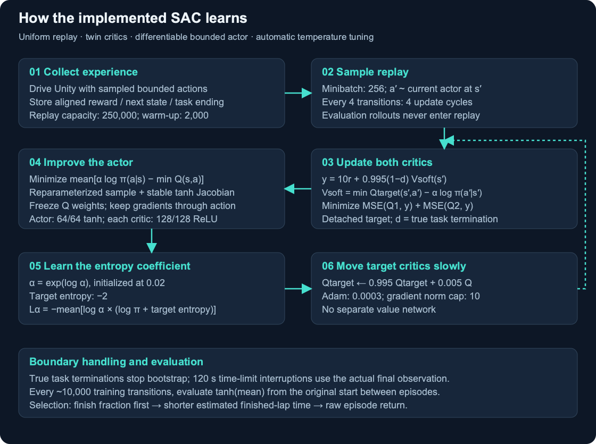

# SAC implementation

`python/train_sac.py` is the final learner. The original run's source snapshot matches the latest local trainer exactly (SHA-256 recorded in [provenance](../policies/provenance.json)). Curation extracted the transport utilities into `unity_env.py`, added portable configuration/capture flags and supported inference/mean exports. The SAC update mathematics remain unchanged.



## Networks and updates

The actor is 15 → 64 → 64 with tanh hidden activations, separate two-output mean and log-standard-deviation heads, and log std clamped to [−5, 1]. A Gaussian `rsample()` passes through tanh. The log probability includes the stable tanh Jacobian correction. Two independent critics take 17 inputs (state plus action), each with 128/128 ReLU hidden layers and a scalar output. There is no separate value network or recurrent module.

A collector aligns each delivered reward and final observation with the preceding submitted action. It handles empty decision deliveries, changing/reused agent IDs and task boundaries before reset decisions. All outcomes enter uniform replay, with capacity 250,000. After 2,000 transitions, every four new transitions trigger four minibatch updates of 256. This is approximately one optimizer cycle per new transition.

The detached critic target is:

```text
a' ~ current actor at s'
y = 10*r + 0.995*(1-task_terminated) *
    [min(Qtarget1(s', a'), Qtarget2(s', a')) - alpha*log_pi(a'|s')]
```

Both critics minimize mean squared error to that target. Actor loss is `mean(alpha.detach()*log_pi(a|s) - min(Q1(s,a), Q2(s,a)))`. Critic weights are frozen during the actor update, while gradients through the action input reach the actor. Unity is never differentiated.

Temperature is learned: `alpha = exp(log_alpha)`, initially 0.02. The loss is `-mean(log_alpha * (log_pi.detach() + target_entropy))`, with target entropy −2. Target critics move 0.005 toward live critics each cycle. Adam learning rate is 0.0003; actor and critic gradient norms are capped at 10. The learner scales reward by 10; Unity's raw reward is unchanged. Discount 0.995 is per policy transition, not physics tick.

## Configuration and initialization

[configs/train.json](../configs/train.json) records the selected run's tunable settings and seed 7. CLI overrides take precedence. Defaults warm-start only the deterministic trunk/mean from [policies/initial-mean.pt](../policies/initial-mean.pt), a compact export of the historical source mean controller. State-dependent exploration starts with std 0.30, and all SAC critics, optimizers and replay are fresh. The historical initialization came from an older learning experiment; that experiment's learning code is excluded. This transfer is part of the reported result's provenance.

`--from-scratch` retains a mild forward mean prior (tanh bias = 0.2) and omits the transfer. It is supported, but has not reproduced the selected performance here.

## Run and resume

```sh
.venv/bin/python python/train_sac.py train \
  --config configs/train.json --track-mode fixed --output runs/my-sac
.venv/bin/tensorboard --logdir runs/my-sac/tensorboard
```

Use Ctrl+C to save a consistent local `latest.pt`. Resume into a **new** output directory:

```sh
.venv/bin/python python/train_sac.py train \
  --config configs/train.json --track-mode fixed --resume runs/my-sac/latest.pt \
  --output runs/my-sac-resumed --max-transitions 2000000
```

The maximum is cumulative across sessions. Resume requires the same Unity build and training/curriculum settings. `latest.pt` includes replay, optimizer and RNG state; selected inference exports cannot resume training. Python state restoration is tested, but Unity's physical episode and hidden simulator RNG restart rather than continuing bit-for-bit.

Evaluation runs between training episodes, approximately every 10,000 transitions, and does not populate replay or disturb action RNG. Policies rank by original-start finish fraction, shorter mean estimated time among finished episodes, then raw return. Training returns mix curriculum starts and are not evaluation results.

## References

SAC's replay, entropy objective and twin-Q approach are described in [Soft Actor-Critic Algorithms and Applications](https://arxiv.org/abs/1812.05905) and [Spinning Up's SAC explanation](https://spinningup.openai.com/en/latest/algorithms/sac.html). This project implements the update directly; network sizes, curriculum, reward scale and safeguards are project choices, not demonstrated optimal hyperparameters.

## Current compact showcase

Bare `python/train_sac.py view` uses the accepted compact actor and seed 1009. Historical fixed examples above retain explicit `--track-mode fixed`; historical procedural pilot examples use `--track-layout open` to reproduce original geometry. Explicit `--track-layout compact` selects the new circuit layout. [Current showcase](compact-showcase.md) · [Layout interface](procedural-tracks.md)
